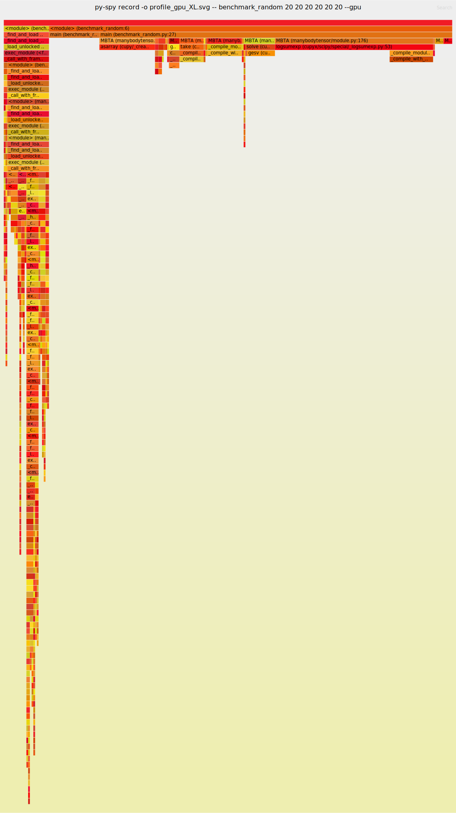

Flame graph of GPU implementation
=================================

Most computation time is spent on ``logsumexp`` operation inside the main loop.
Input tensor size was increased by 2 dimension for easier comparison
with the original implementation

Right click + 'Open image in new tab' to see timing details.

